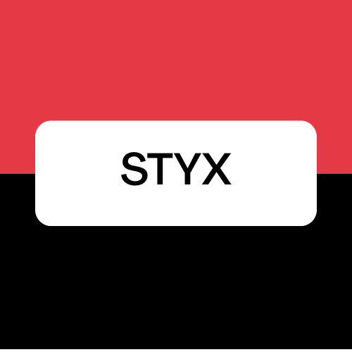

# Prompt pour Claude Code — Application Styx (Cashflow Job Configuration)

---

## Ce qu'est vraiment Styx — contexte métier précis

Styx est l'interface de soumission et de monitoring de **jobs de calcul actuariel** (cashflow, SCR, pricing de dérivés…) pour le moteur de calcul **OMEN** (modèle Société Générale Assurances). L'application existante est en light mode, fond blanc, design utilitaire. La nouvelle version doit reprendre **exactement la même logique fonctionnelle** mais avec le design system FETEAD (dark/light toggle, rouge SG, Bebas Neue, DM Mono, texture de bruit).

### Les types de jobs (lignes du menu "Omen Jobs")
Observés dans l'application réelle :
- **S — Savings** (Épargne)
- **N — Non Life** (Non-Vie)
- **RL — Risk Life** (Risque Vie)
- **KP — Risk Life KP**
- **T — TdR** (Taux de Revalorisation)
- **B — BdR**

Chaque type a son propre formulaire de configuration, mais tous partagent une structure commune.

### Navigation principale (barre d'icônes centrée)
Barre horizontale centrée, fixe, positionnée sous le header. **7 boutons** dans cet ordre de gauche à droite :

```
[+ New Job] [Omen Jobs ▾] [⚙ Settings] [📊 Monitoring] [🖥 Console] [? Help] [ℹ About]
```

Ordre de droite à gauche (important pour repérage utilisateur) :
- **Position 1 (extrême droite)** : `ℹ About` (bleu) — ouvre le panneau Help Center
- **Position 2** : `?` — aussi Help Center (alias)
- **Position 3** : bouton général app / préférences utilisateur (voir ci-dessous)
- **Position 4** : `🖥 Console` — **toggle** qui fait apparaître/disparaître la console en bas de page
- **Position 5** : `📊 Monitoring` — navigue vers la vue monitoring
- **Position 6** : `⚙ Settings` — paramètres
- **Position 7 (extrême gauche)** : `+ New Job` avec `Omen Jobs ▾` dropdown

Le dropdown "Omen Jobs" affiche les types avec une pastille colorée (initiale en blanc sur fond rouge/noir) + nom.

### Formulaire "New Omen [Type] Job" — champs observés
Structure d'un job Savings (le plus complet) :

```
Name:              [input texte]                              [Submit — .btn-submit]  [Advanced Options — .btn-secondary]
Environment:       [input texte — chemin réseau UNC]          [Browse]  [Open]
Inputs:            [select — liste d'inputs disponibles]
User Settings:     [Browse] [Last]
                   [Reference] [Custom]   ← toggle boutons
Version Omen:      [select — modèle ex: 2026.01.00]
                   [select — version ex: 2026.01.00_merge]
Iteration Range /  □ Deterministic  [1-1000] [1Y] [5Y] [30Y] [40Y] [Custom] [12] [month(s)]
Period:            □ Stochastic     [1-1000] [1Y] [5Y] [30Y] [40Y] [Custom] [12] [month(s)]
Guaranteed Floor:  □ (checkbox)
Pricer derivatives:□              [1-1000] [1Y] [5Y] [30Y] [40Y] [Custom] [12] [month(s)]
Job Omen Type:     [select — ex: S2]
Scenarios:         □ all
                   [tableau de scénarios avec colonnes: Select | Num | Name | File RN | File Det | File Sto]
```

### Advanced Options (modal/panneau latéral)
Observé dans les screenshots :
```
[Sliding]              [Test Sliding]
[Launch Input Task Only]
Job Priority:          [select — Automatic / Normal / High / ...]
Task Type:             [select]
Number Of Iterations   [input numérique — ex: 12]
for Life SCRs:
[Do Not Make Average]
Delayed Execution:     [date picker — jj/mm/aaaa]
```

### Monitoring — vue liste des jobs
Colonnes observées :
```
State (●) | Id | Name | Progress (barre de progression) | Priority | Account Name | Created | Submitted | Last Update
```
- Filtres en haut : Job Id (input), Job Name (input), Job Priority (input), Account Name (input)
- Checkbox "Full View"
- Barre de progression (100% ou en cours) — couleur --green (sémantique : succès)
- State = point coloré (● --green = terminé, ● #f59e0b = en cours, ● --red = erreur) — ces couleurs sont sémantiques (statut), pas des choix de design

### File Explorer (modal)
Un explorateur de fichiers réseau s'ouvre quand on clique Browse :
```
[input chemin] 
[liste de dossiers/fichiers avec icônes]
[Sélectionner]  [Annuler]
```
Dossiers observés : case, convergence, input, output, scenario

---

## Job UFX — formulaire spécifique

Le job UFX est accessible depuis la barre de navigation (onglet "UFX Job"). Son formulaire est plus simple que Savings :

```
New UFX Job

Name:       [input texte]
Path:       [input texte — chemin vers le fichier UFX]
            □ Is Folder
                                                [Submit — .btn-submit]
                                                [🗑 — .btn-secondary avec icône corbeille]
```

Caractéristiques :
- Formulaire minimaliste, 3 champs seulement
- Bouton Submit (.btn-submit) en haut à droite
- Bouton icône (.btn-secondary) sous Submit pour supprimer / réinitialiser
- La checkbox "Is Folder" change le comportement du champ Path (sélection dossier vs fichier)

```html
<!-- Structure du formulaire UFX -->
<div class="job-form" id="formUfx">
  <h2 class="form-title">New UFX Job</h2>
  <div class="form-actions-top">
    <button class="btn-submit" id="submitUfx">Submit</button>
    <button class="btn-delete" id="deleteUfx">
      <svg><!-- corbeille --></svg>
    </button>
  </div>
  <div class="form-grid">
    <label>Name:</label>
    <input type="text" id="ufxName" placeholder="">
    
    <label>Path:</label>
    <input type="text" id="ufxPath" placeholder="">
    
    <label></label>
    <label class="checkbox-label">
      <input type="checkbox" id="ufxIsFolder"> Is Folder
    </label>
  </div>
</div>
```

---

## Console — panneau bas de page (toggle)

La console est un **panneau coulissant** qui s'ouvre depuis le bas de la page via le bouton Console (2e depuis la droite dans la barre de navigation). C'est un toggle : un clic ouvre, un second clic ferme.

```
┌─────────────────────────────────────────────────────────┐
│ CONSOLE                                        [× fermer]│  ← handle/header
├─────────────────────────────────────────────────────────┤
│ [12:34:01] Job XK_Omen_Savings submitted — id: 4        │
│ [12:34:05] Connecting to environment...                  │
│ [12:34:08] Job started — 0% complete                     │
│ [12:35:22] Progress: 45%                                 │
│ [12:37:11] Progress: 100% — Job completed successfully   │
└─────────────────────────────────────────────────────────┘
```

Comportement :
- Position `fixed`, `bottom: 0`, `left: 0`, `right: 0`
- Hauteur : 200px quand ouverte, 0 quand fermée (transition CSS)
- Le bouton Console dans la nav prend une apparence "active" quand la console est ouverte
- Messages horodatés en DM Mono, couleurs : blanc normal, orange warning, rouge erreur
- Auto-scroll vers le bas à chaque nouveau message

```css
.console-panel {
  position: fixed; bottom: 0; left: 0; right: 0;
  height: 0; overflow: hidden;
  background: #0d0d0d; border-top: 2px solid var(--red);
  transition: height .3s cubic-bezier(.4,0,.2,1);
  z-index: 150; font-family: 'DM Mono'; font-size: .72rem;
}
.console-panel.open { height: 200px; }
.console-header {
  display: flex; align-items: center; justify-content: space-between;
  padding: 6px 16px; border-bottom: 1px solid #222;
  font-family: 'Bebas Neue'; font-size: .85rem; letter-spacing: .12em; color: var(--red);
}
.console-body { padding: 8px 16px; overflow-y: auto; height: calc(100% - 32px); }
.console-line { margin-bottom: 3px; color: var(--text-dim); }
.console-line .ts { color: var(--text-faint); margin-right: 8px; }
.console-line.warn { color: #f59e0b; }
.console-line.error { color: #e06060; }
```

```javascript
// Toggle console
$('#btnConsole').on('click', function() {
  const isOpen = $('.console-panel').hasClass('open');
  $('.console-panel').toggleClass('open');
  $(this).toggleClass('active');
});

// Ajouter un message
function consoleLog(msg, type='info') {
  const ts = new Date().toLocaleTimeString('fr-FR');
  const cls = type === 'warn' ? 'warn' : type === 'error' ? 'error' : '';
  const $line = $(`<div class="console-line ${cls}"><span class="ts">[${ts}]</span>${msg}</div>`);
  $('#consoleBody').append($line);
  $('#consoleBody').scrollTop($('#consoleBody')[0].scrollHeight);
}
```

---

## Help Center — panneau latéral droit

Déclenché par les boutons **About** (ℹ, bleu) ET **?** (help). S'ouvre comme un panneau latéral fixe sur la droite de la page (pas une overlay plein écran).

```
┌─────────────────────────────┐
│ Help center            [×]  │  ← header
├─────────────────────────────┤
│                             │
│  [contenu d'aide            │
│   contextuel selon la       │
│   page active]              │
│                             │
│  Documentation :            │
│  • Soumettre un job Savings │
│  • Configurer les scénarios │
│  • Comprendre le monitoring │
│  • Options avancées         │
│                             │
└─────────────────────────────┘
```

```css
.help-panel {
  position: fixed; top: 0; right: -340px; width: 340px; height: 100vh;
  background: var(--bg-card); border-left: 1px solid var(--bg-border);
  border-left: 2px solid var(--red);
  z-index: 250; transition: right .3s cubic-bezier(.4,0,.2,1);
  display: flex; flex-direction: column;
  box-shadow: -8px 0 32px rgba(0,0,0,.4);
}
.help-panel.open { right: 0; }
.help-header {
  padding: 18px 20px; border-bottom: 1px solid var(--bg-border);
  display: flex; align-items: center; justify-content: space-between;
  font-family: 'Bebas Neue'; font-size: 1.1rem; letter-spacing: .1em; color: var(--text);
}
.help-body { padding: 20px; overflow-y: auto; flex: 1; }
.help-section { margin-bottom: 22px; }
.help-section h4 { font-family: 'DM Mono'; font-size: .65rem; letter-spacing: .18em; text-transform: uppercase; color: var(--red); margin-bottom: 10px; }
.help-section li { font-size: .8rem; color: var(--text-dim); padding: 5px 0; border-bottom: 1px solid var(--bg-border); cursor: pointer; transition: color .15s; }
.help-section li:hover { color: var(--text); }
```

```javascript
// Both About and Help buttons toggle the panel
$('#btnAbout, #btnHelp').on('click', function() {
  $('.help-panel').toggleClass('open');
});
$('#closeHelp').on('click', () => $('.help-panel').removeClass('open'));
```

---

## Panneau Général / Préférences utilisateur

Bouton situé **entre le bouton Help (?) et le badge utilisateur** dans le header. Ouvre un panneau ou une modale présentant les informations générales de l'application et les préférences.

```
┌──────────────────────────────────────┐
│ Général                         [×]  │
├──────────────────────────────────────┤
│ APPLICATION                          │
│ Version       2026.01.00             │
│ Environnement Recette                │
│ Serveur       \\srv\styx\recette     │
│                                      │
│ PRÉFÉRENCES UTILISATEUR              │
│ Thème         [Dark ● / Light]       │
│ Langue        [FR ▾]                 │
│ Job Priority  [Automatic ▾]          │
│ par défaut                           │
│                                      │
│ COMPTE                               │
│ Utilisateur   John DOE          │
│ Rôle          Actuaire               │
│ Équipe        ASSU · MCA      │
│                                      │
│                    [Enregistrer]     │
└──────────────────────────────────────┘
```

```css
/* Même style que les autres modales mais max-width 420px */
.modal-general { max-width: 420px; }
.pref-section { margin-bottom: 22px; }
.pref-section-title { font-family: 'DM Mono'; font-size: .6rem; letter-spacing: .2em; text-transform: uppercase; color: var(--red); margin-bottom: 12px; padding-bottom: 6px; border-bottom: 1px solid var(--bg-border); }
.pref-row { display: flex; justify-content: space-between; align-items: center; padding: 8px 0; font-size: .8rem; color: var(--text-dim); border-bottom: 1px solid var(--bg-border); }
.pref-row:last-child { border-bottom: none; }
.pref-row span:first-child { color: var(--text-faint); font-family: 'DM Mono'; font-size: .72rem; }
.pref-row span:last-child { color: var(--text); font-weight: 500; }
```

---

## Identité visuelle — à reproduire scrupuleusement

### Couleurs
```css
--red:       #E2001A;
--red-dark:  #a80013;
--red-glow:  rgba(226,0,26,0.11);
--cyan:      #0EB8C8;
--green:     #00C875;

[data-theme="dark"]
--bg:        #0a0a0a;
--bg-card:   #1a1a1a;
--bg-input:  #111;
--bg-border: #272727;
--bg-border-hover: #3a3a3a;
--text:      #f5f5f5;
--text-dim:  rgba(245,245,245,0.48);
--text-faint:rgba(245,245,245,0.18);
--header-bg: rgba(10,10,10,0.94);
--noise:     0.026;
--row-hover: rgba(255,255,255,0.022);
--pill-bg:   #2a2a2a;

[data-theme="light"]
--bg:        #f3f3f3;
--bg-card:   #ffffff;
--bg-input:  #f8f8f8;
--bg-border: #e0e0e0;
--bg-border-hover: #bbb;
--text:      #080808;
--text-dim:  rgba(8,8,8,0.48);
--text-faint:rgba(8,8,8,0.2);
--header-bg: rgba(243,243,243,0.96);
--noise:     0.015;
--row-hover: rgba(0,0,0,0.022);
--pill-bg:   #ebebeb;
```

### Typographie
```html
<link href="https://fonts.googleapis.com/css2?family=Bebas+Neue&family=DM+Sans:wght@300;400;500;600&family=DM+Mono:wght@400;500&display=swap" rel="stylesheet">
```
- **Bebas Neue** → titres de page, KPI, boutons principaux, en-têtes de tableaux
- **DM Sans** → corps de texte, labels de formulaire, descriptions
- **DM Mono** → valeurs techniques (chemins, IDs, versions), tags, métadonnées

### Logo
```html

```
Transition hover : `transform: scale(1.06)` sur 0.2s.

### Texture de bruit (body::before)
```css
body::before {
  content: '';
  position: fixed; inset: 0;
  background-image: url("data:image/svg+xml,%3Csvg viewBox='0 0 200 200' xmlns='http://www.w3.org/2000/svg'%3E%3Cfilter id='n'%3E%3CfeTurbulence type='fractalNoise' baseFrequency='0.85' numOctaves='4' stitchTiles='stitch'/%3E%3C/filter%3E%3Crect width='100%25' height='100%25' filter='url(%23n)'/%3E%3C/svg%3E");
  opacity: var(--noise);
  pointer-events: none; z-index: 0;
}
```

---

## Architecture des fichiers

```
styx-home.html        ← page d'accueil / dashboard (optionnelle)
styx-jobs.html        ← formulaire de création de job (page principale)
styx-monitoring.html  ← liste et suivi des jobs
logo.png              ← logo à placer à la racine
```

---

## Structure du header — identique sur toutes les pages

```
┌──────────────────────────────────────────────────────────────┐
│ [3px barre rouge fixe en haut]                               │
├──────────────────────────────────────────────────────────────┤
│ [logo] STYX              [Dark ●── Light]  │  [PR] Pablo R.  │ 58px
│        Calcul Actuariel  Assurances        │  Sign Out        │
└──────────────────────────────────────────────────────────────┘
```

- Position fixed, backdrop-filter blur(18px)
- Toggle dark/light persisté dans `localStorage` clé `'styx-theme'`
- Pas de subnav : la navigation se fait via la barre d'icônes centrée (voir ci-dessous)

### Barre de navigation centrée (icônes)
```html
<!-- Centrée dans la page, sous le header, position fixed -->
<nav class="icon-nav">
  <div class="icon-btn-group">
    <button class="nav-icon active" id="btnNewJob" title="New Job">
      <!-- icône + verte -->
    </button>
    <button class="nav-icon dropdown-trigger" id="btnOmenJobs" title="Omen Jobs">
      <!-- icône liste rouge + flèche bas -->
      <div class="nav-dropdown">
        <div class="job-type-option" data-type="savings">
          <span class="type-badge">S</span> Savings
        </div>
        <div class="job-type-option" data-type="nonlife">
          <span class="type-badge">N</span> Non Life
        </div>
        <div class="job-type-option" data-type="risklife">
          <span class="type-badge">RL</span> Risk Life
        </div>
        <div class="job-type-option" data-type="risklifekp">
          <span class="type-badge">KP</span> Risk Life KP
        </div>
        <div class="job-type-option" data-type="tdr">
          <span class="type-badge">T</span> TdR
        </div>
        <div class="job-type-option" data-type="bdr">
          <span class="type-badge">B</span> BdR
        </div>
      </div>
    </button>
    <button class="nav-icon" id="btnSettings" title="Settings"><!-- engrenage --></button>
    <button class="nav-icon" id="btnMonitoring" title="Monitoring"><!-- graphique --></button>
    <button class="nav-icon" id="btnConsole" title="Console"><!-- écran --></button>
    <button class="nav-icon" id="btnAbout" title="About"><!-- info --></button>
  </div>
</nav>
```

Style des pastilles de type :
```css
.type-badge {
  display: inline-flex; align-items: center; justify-content: center;
  width: 32px; height: 32px;
  background: linear-gradient(135deg, var(--red) 50%, #111 50%);
  color: #fff; font-family: 'Bebas Neue'; font-size: .85rem;
  border-radius: 2px;
}
```

---

## Page principale — `styx-jobs.html`

### Layout général — 3 zones dynamiques

```
┌─────────────────────────────────────────────────────────────────┐
│ HEADER fixe (61px)                                              │
├─────────────────────────────────────────────────────────────────┤
│ BARRE ICÔNES centrée fixe (48px)                                │
├──────────────┬──────────────────────────────────────────────────┤
│              │                                                  │
│  SIDEBAR     │  ZONE JOBS (flex:1)                              │
│  GAUCHE      │                                                  │
│  ~140px      │  ┌────────────────────────────────────────────┐  │
│              │  │  New Omen Savings Job   (80% hauteur)       │  │
│  [Omen       │  │  ou Monitoring                              │  │
│   Savings ×] │  │                                             │  │
│              │  └────────────────────────────────────────────┘  │
│  [UFX Job ×] │  ┌────────────────────────────────────────────┐  │
│              │  │  CONSOLE  (20% hauteur, si active)          │  │
│  [Monitoring │  │  [12:34] Job submitted...                   │  │
│   ×]         │  └────────────────────────────────────────────┘  │
│              │                                                  │
└──────────────┴──────────────────────────────────────────────────┘
```

**Règles de comportement dynamique :**

1. **Console toggle** :
   - Console **active** → zone jobs = 80% de hauteur, console = 20%
   - Console **inactive** → zone jobs = 100% de hauteur, console = height:0 (masquée)
   - Transition CSS sur la hauteur (pas de saut brusque)

2. **Sidebar toggle** :
   - Sidebar **visible** → zone droite = `calc(100% - 140px)`
   - Sidebar **réduite/cachée** → zone droite = 100% de la largeur
   - La sidebar se réduit via un bouton de collapse (chevron `‹` / `›`)

3. La sidebar et la console sont **indépendantes** — on peut avoir les deux, une seule, ou aucune

**Implémentation CSS (Grid)** :
```css
.app-layout {
  display: grid;
  grid-template-columns: var(--sidebar-w, 140px) 1fr;
  grid-template-rows: 1fr var(--console-h, 0px);
  height: calc(100vh - 109px); /* 100vh - header - icon-nav */
  transition: grid-template-columns .25s ease, grid-template-rows .25s ease;
}
.app-layout.sidebar-collapsed {
  grid-template-columns: 0px 1fr;
}
.app-layout.console-open {
  --console-h: 200px;
  grid-template-rows: 1fr 200px;
}
.sidebar    { grid-column: 1; grid-row: 1 / 3; overflow: hidden; }
.job-area   { grid-column: 2; grid-row: 1; overflow-y: auto; }
.console-panel { grid-column: 2; grid-row: 2; overflow: hidden; }
```

**Sidebar — onglets de fenêtres ouvertes** :
```html
<aside class="sidebar" id="appSidebar">
  <div class="sidebar-collapse-btn" id="btnCollapseSidebar">
    <svg><!-- chevron gauche/droite --></svg>
  </div>
  <div class="sidebar-tabs" id="sidebarTabs">
    <!-- généré dynamiquement quand un job est ouvert -->
    <div class="sidebar-tab active" data-job="savings-1">
      <span class="tab-label">Omen Savings</span>
      <button class="tab-close">×</button>
    </div>
    <div class="sidebar-tab" data-job="ufx-1">
      <span class="tab-label">UFX Job</span>
      <button class="tab-close">×</button>
    </div>
    <div class="sidebar-tab" data-job="monitoring">
      <span class="tab-label">Monitoring</span>
      <button class="tab-close">×</button>
    </div>
  </div>
</aside>
```

Style des onglets sidebar :
```css
.sidebar {
  border-right: 1px solid var(--bg-border);
  background: var(--bg-card);
  display: flex; flex-direction: column;
  overflow: hidden; transition: width .25s ease;
}
.sidebar-collapse-btn {
  padding: 8px; cursor: pointer; border-bottom: 1px solid var(--bg-border);
  display: flex; justify-content: center; color: var(--text-dim);
  transition: color .2s;
}
.sidebar-collapse-btn:hover { color: var(--red); }
.sidebar-tab {
  display: flex; align-items: center; justify-content: space-between;
  padding: 10px 12px; border-bottom: 1px solid var(--bg-border);
  cursor: pointer; font-family: 'DM Mono'; font-size: .67rem;
  color: var(--text-dim); border-left: 2px solid transparent;
  transition: all .15s; white-space: nowrap; overflow: hidden;
}
.sidebar-tab:hover  { background: var(--row-hover); color: var(--text); }
.sidebar-tab.active { border-left-color: var(--red); color: var(--text); background: var(--row-hover); }
.tab-close {
  background: none; border: none; color: inherit; cursor: pointer;
  font-size: .9rem; opacity: .5; padding: 0 0 0 8px; flex-shrink: 0;
  transition: opacity .15s, color .15s;
}
.tab-close:hover { opacity: 1; color: var(--red); }
```

**jQuery — gestion des onglets** :
```javascript
// Ouvrir un nouveau job → crée un onglet dans la sidebar + affiche le formulaire
function openJob(type, label) {
  const id = type + '-' + Date.now();
  // Ajouter onglet
  const $tab = $(`<div class="sidebar-tab" data-job="${id}">
    <span class="tab-label">${label}</span>
    <button class="tab-close">×</button>
  </div>`);
  $('#sidebarTabs').append($tab);
  // Activer
  activateTab(id);
}

function activateTab(id) {
  $('.sidebar-tab').removeClass('active');
  $(`.sidebar-tab[data-job="${id}"]`).addClass('active');
  // Afficher la vue correspondante dans #jobArea
  $('.job-view').hide();
  $(`#view-${id}`).show();
}

// Fermer un onglet
$(document).on('click', '.tab-close', function(e) {
  e.stopPropagation();
  const $tab = $(this).closest('.sidebar-tab');
  const id = $tab.data('job');
  $tab.remove();
  $(`#view-${id}`).remove();
  // Activer le dernier onglet restant
  const $last = $('.sidebar-tab').last();
  if ($last.length) activateTab($last.data('job'));
});

// Toggle sidebar
$('#btnCollapseSidebar').on('click', function() {
  $('.app-layout').toggleClass('sidebar-collapsed');
  $(this).find('svg').toggleClass('flipped');
});

// Toggle console
$('#btnConsole').on('click', function() {
  $('.app-layout').toggleClass('console-open');
  $(this).toggleClass('active');
});
```

### Formulaire — disposition en grille 2 colonnes
```
Label (col 1, 25%)          |  Contrôle (col 2, 60%)    |  Actions (col 3, 15%)
────────────────────────────────────────────────────────────────────────────────
Name:                       |  [input texte]             |
Environment:                |  [input texte — chemin UNC]|  [Browse] [Open]
Inputs:                     |  [select ou input]         |
User Settings:              |  [Browse] [Last]           |
                            |  [Reference●] [Custom]     |
Version Omen:               |  [select modèle]           |
                            |  [select version]          |
Iteration Range / Period:   |  □ Deterministic  [1-1000] [1Y●] [5Y] [30Y] [40Y] [Custom] [12] [month(s)]
                            |  □ Stochastic     [1-1000] [1Y●] [5Y] [30Y] [40Y] [Custom] [12] [month(s)]
Guaranteed Floor:           |  □ (checkbox seul)         |
Pricer derivatives:         |  □  [1-1000] [1Y●] [5Y] [30Y] [40Y] [Custom] [12] [month(s)]
Job Omen Type:              |  [select]                  |
Scenarios:                  |  □ all                     |
                            |  [tableau scénarios]       |
────────────────────────────────────────────────────────────────────────────────
                                           [Submit — .btn-submit]  [Advanced Options — .btn-secondary]
```

### Composant "Iteration Range" — boutons de période
C'est un groupe de boutons toggle (un seul actif à la fois, surligné en bleu foncé) :
```html
<div class="period-group">
  <input type="text" class="range-input" value="1-1000" placeholder="1-1000">
  <button class="period-btn active">1 years</button>
  <button class="period-btn">5 years</button>
  <button class="period-btn">30 years</button>
  <button class="period-btn">40 years</button>
  <button class="period-btn">Custom</button>
  <input type="number" class="months-input" value="12">
  <span class="months-label">month(s)</span>
</div>
```
Style du bouton actif :
```css
.period-btn.active { border-color: var(--red); color: var(--red); background: var(--red-glow); }
.period-btn        { background: var(--bg-input); color: var(--text-dim); border: 1px solid var(--bg-border); padding: 4px 10px; font-family: 'DM Mono'; font-size: .7rem; cursor: pointer; }
```

### Composant "User Settings" — boutons toggle Reference/Custom
```css
.settings-toggle { 
  padding: 6px 16px; border: 1px solid var(--bg-border);
  font-family: 'DM Mono'; font-size: .7rem; cursor: pointer;
}
.settings-toggle.active { border-color: var(--red); color: var(--red); background: var(--red-glow); }
```

### Tableau Scénarios
```html
<table class="scenarios-table">
  <thead>
    <tr><th>Select</th><th>Num</th><th>Name</th><th>File RN</th><th>File Det</th><th>File Sto</th></tr>
  </thead>
  <tbody>
    <!-- lignes de scénarios avec checkbox en col 1 -->
    <tr>
      <td><input type="checkbox"></td>
      <td class="mono">1</td>
      <td class="mono small">2022Y_EUR_S2_Officiel_Tx328VA19_central_ZC.csv</td>
      <td class="mono small">2022Y_EUR_S2_Officiel_Tx328VA19_central_ZC.csv</td>
      <td class="mono small">2022Y_EUR_S2_Officiel_Tx328VA19_M_ZC.csv</td>
      <td class="mono small">2022Y_EUR_S2_Officiel_Tx328VA19_central_ZC.csv</td>
    </tr>
  </tbody>
</table>
```

### Boutons d'action principaux (coin haut droit du formulaire)

**Règle générale : tous les boutons restent dans le design system FETEAD.** Les couleurs vues dans les screenshots (vert Submit, bleu Advanced Options, rouge Browse) sont celles de l'application existante — elles ne doivent PAS être reproduites.

Le seul bouton visuellement démarqué est **Submit**, car c'est l'action finale et irréversible (lancement d'un calcul). Il doit être immédiatement identifiable.

```css
/* Submit — démarqué : fond rouge SG plein, taille légèrement supérieure */
.btn-submit {
  background: var(--red);
  color: #fff;
  font-family: 'Bebas Neue';
  font-size: 1.1rem;
  letter-spacing: .14em;
  padding: 11px 28px;
  border: none;
  cursor: pointer;
  transition: background .2s;
}
.btn-submit:hover { background: var(--red-dark); }

/* Tous les autres boutons — style secondaire FETEAD standard */
.btn-secondary {
  background: transparent;
  color: var(--text-dim);
  font-family: 'DM Mono';
  font-size: .67rem;
  letter-spacing: .1em;
  text-transform: uppercase;
  padding: 9px 16px;
  border: 1px solid var(--bg-border);
  cursor: pointer;
  transition: border-color .2s, color .2s;
}
.btn-secondary:hover { border-color: var(--red); color: var(--text); }

/* Toggle actif (Reference●, Sliding●, 1 years●, etc.) — accent rouge discret */
.btn-toggle.active {
  border-color: var(--red);
  color: var(--red);
  background: var(--red-glow);
}
```

Correspondances boutons → style :
| Bouton | Style |
|---|---|
| **Submit** | `.btn-submit` — rouge SG plein, Bebas Neue, taille +1 |
| Advanced Options | `.btn-secondary` |
| Browse, Open, Last | `.btn-secondary` |
| Reference / Custom | `.btn-toggle` (secondaire + état actif rouge) |
| Sliding / Test Sliding / Launch Input… | `.btn-toggle` |
| Do Not Make Average | `.btn-toggle` |
| 1Y / 5Y / 30Y / 40Y / Custom | `.btn-toggle` |
| Sélectionner (file explorer) | `.btn-secondary` |
| Annuler | `.btn-secondary` |
| Enregistrer (préférences) | `.btn-secondary` |

---

## Modal "Advanced Options"

```html
<div class="overlay" id="mAdvanced">
  <div class="modal">
    <div class="modal-title">Advanced Options</div>
    <button class="modal-close" data-close="mAdvanced">×</button>
    
    <!-- Toggle buttons row 1 -->
    <div class="adv-row">
      <button class="adv-toggle active">Sliding</button>
      <button class="adv-toggle">Test Sliding</button>
    </div>
    
    <!-- Toggle button row 2 -->
    <div class="adv-row">
      <button class="adv-toggle">Launch Input Task Only</button>
    </div>
    
    <!-- Fields -->
    <div class="fg">
      <label>Job Priority :</label>
      <!-- custom select : Automatic / Normal / High -->
    </div>
    <div class="fg">
      <label>Task Type :</label>
      <!-- custom select -->
    </div>
    <div class="fg">
      <label>Number Of Iterations for Life SCRs :</label>
      <input type="number" value="12">
    </div>
    
    <!-- Toggle button -->
    <div class="adv-row">
      <button class="adv-toggle">Do Not Make Average</button>
    </div>
    
    <div class="fg">
      <label>Delayed Execution :</label>
      <input type="date">
    </div>
  </div>
</div>
```

Style des toggles Advanced Options — **design system FETEAD, pas bleu** :
```css
/* Même pattern que tous les autres boutons toggle */
.adv-toggle        { background: transparent; border: 1px solid var(--bg-border); color: var(--text-dim); padding: 8px 16px; font-family: 'DM Mono'; font-size: .7rem; letter-spacing: .08em; cursor: pointer; margin-right: 6px; margin-bottom: 10px; transition: all .2s; }
.adv-toggle:hover  { border-color: var(--bg-border-hover); color: var(--text); }
.adv-toggle.active { border-color: var(--red); color: var(--red); background: var(--red-glow); }
```

---

## Modal "File Explorer" (Browse)

```html
<div class="overlay" id="mBrowse">
  <div class="modal" style="max-width:500px">
    <div class="modal-title">Explorateur de fichiers</div>
    <input type="text" id="browseCurrentPath" value="\\srv\styx\recette\_usecases\savings\Cas02\4-Omen">
    <div class="file-list">
      <div class="file-item folder"><span class="file-icon">📁</span> case</div>
      <div class="file-item folder"><span class="file-icon">📁</span> convergence</div>
      <div class="file-item folder"><span class="file-icon">📁</span> input</div>
      <div class="file-item folder"><span class="file-icon">📁</span> output</div>
      <div class="file-item folder"><span class="file-icon">📁</span> scenario</div>
    </div>
    <div class="modal-acts">
      <button class="btn-save" id="btnSelect">Sélectionner</button>
      <button class="btn-cancel" data-close="mBrowse">Annuler</button>
    </div>
  </div>
</div>
```

---

## Page Monitoring — `styx-monitoring.html`

### Filtres en haut de page
```html
<div class="monitor-filters">
  <input type="text" placeholder="Job Id">
  <input type="text" placeholder="Job Name">
  <input type="text" placeholder="Job Priority">
  <input type="text" placeholder="Account Name">
  <label><input type="checkbox"> Full View</label>
</div>
```

### Tableau de monitoring
```
State | Id | Name                          | Progress    | Priority  | Account Name     | Created    | Submitted  | Last Update
●     | 4  | X_Omen Savings Cas 05-delayed | [████ 100%] | Automatic | 2-2 17:22        | 9-1 1.8    | 9-1 6.0    |
●     | 3  | X_Omen Savings Cas 05-delayed | [████ 100%] | Normal    | 2-2 12:23        |            | 9-1 1.2    |
●     | 5  | X_Omen Savings Cas 05-delayed | [██░░  8%]  | Automatic | Toby Jean Luc B. | 2-2 12:54  | 9-1 1.8    |
●     | 1  | XG_Omen Savings Cas 02 #2     | [████ 100%] | High      | 2-2 11:8         | 2-2 17:24  | 2-2 17:24  | 9-1 1.8
```

Barre de progression :
```css
.progress-bar-wrap { width: 120px; height: 12px; background: var(--bg-border); border-radius: 2px; }
.progress-bar      { height: 100%; background: var(--green); border-radius: 2px; transition: width .3s; }
```

Point de statut :
```css
.state-dot        { width: 10px; height: 10px; border-radius: 50%; display: inline-block; }
.state-dot.done   { background: var(--green); }
.state-dot.running{ background: #f59e0b; }
.state-dot.error  { background: var(--red); }
```

Filtre live (jQuery) :
```javascript
$('#filterName').on('input', function() {
  const q = $(this).val().toLowerCase();
  $('#monitorBody tr').each(function() {
    $(this).toggle($(this).text().toLowerCase().includes(q));
  });
});
```

---

## Composants UI réutilisables

### Champs texte et date
```css
input[type="text"], input[type="number"], input[type="date"], select {
  background: var(--bg-input); border: 1px solid var(--bg-border);
  color: var(--text); font-family: 'DM Mono'; font-size: .76rem;
  padding: 8px 11px; outline: none; width: 100%;
  transition: border-color .2s, box-shadow .2s;
}
input:focus, select:focus { border-color: var(--red); box-shadow: 0 0 0 3px var(--red-glow); }
input::placeholder { color: var(--text-faint); font-style: italic; }
```

### Custom Select (jamais de `<select>` natif pour les champs simples importants)
```html
<div class="custom-select">
  <div class="cs-trigger"><span class="cs-value">-- Choose --</span>
    <svg><!-- chevron --></svg>
  </div>
  <div class="cs-dropdown">
    <div class="cs-option" data-value="auto">Automatic</div>
    <div class="cs-option" data-value="normal">Normal</div>
    <div class="cs-option" data-value="high">High</div>
  </div>
  <input type="hidden" value="">
</div>
```

### Tableaux
```css
thead   { background: var(--red); }
th      { font-family: 'Bebas Neue'; color: #fff; padding: 10px 12px; letter-spacing: .08em; }
td      { padding: 10px 12px; font-size: .76rem; color: var(--text-dim); border-bottom: 1px solid var(--bg-border); }
tr:hover td { background: var(--row-hover); }
```

### Footer
```
© Groupe Société Générale | ASSU 2026          [module name]
```

---

## JavaScript — règles obligatoires

1. **jQuery 3.7.1** via CDN : `https://cdnjs.cloudflare.com/ajax/libs/jquery/3.7.1/jquery.min.js`
2. **Tout dans `$(function(){...})`**
3. **Theme toggle** (clé `'styx-theme'`) :
```javascript
const KEY = 'styx-theme';
function applyTheme(t) {
  $('html').attr('data-theme', t);
  localStorage.setItem(KEY, t);
  $('#lblDark').css('opacity',  t==='dark'  ? 1 : .35);
  $('#lblLight').css('opacity', t==='light' ? 1 : .35);
}
$('#themeTgl').on('click', () => applyTheme($('html').attr('data-theme')==='dark' ? 'light' : 'dark'));
applyTheme(localStorage.getItem(KEY) || 'dark');
```
4. **Dropdown "Omen Jobs"** : clic sur le trigger ouvre le menu, clic sur un type charge le formulaire correspondant dans la zone principale
5. **Validation** : uniquement au submit, jamais au blur — toujours une branche `else` qui retire `is-invalid`
6. **Regex JS sans double-échappement** : `/\d/` et non `/\\d/`
7. **Réinitialiser les modales** intégralement à chaque ouverture
8. **Pas de `<form>`** HTML — utiliser des `<div>` avec handlers jQuery
9. **Animations** :
```css
@keyframes fadeUp { from{opacity:0;transform:translateY(12px)} to{opacity:1;transform:translateY(0)} }
```

---

## Responsive

```css
@media (max-width: 900px) {
  .header-main { padding: 0 20px; }
  main { padding-left: 20px; padding-right: 20px; }
  .form-grid { grid-template-columns: 1fr; }
  .sidebar { display: none; }
  .user-role { display: none; }
  footer { flex-direction: column; gap: 4px; }
}
@media (max-width: 600px) {
  .logo-sub { display: none; }
  .user-name, .user-role { display: none; }
  .modal { padding: 20px 16px; margin: 10px; }
  .tbl-wrap { overflow-x: auto; }
  table { min-width: 600px; }
  .period-group { flex-wrap: wrap; gap: 4px; }
}
```

---

## Contraintes absolues

- Fichiers HTML autonomes, zéro build tool, zéro framework CSS
- Chaque fichier se suffit à lui-même (CDN pour jQuery et Google Fonts)
- `logo.png` à la racine du projet
- Pas de `localStorage` pour les données métier — uniquement pour le thème
- Validation uniquement au submit
- Regex JS sans double-échappement (`/\d/` pas `/\\d/`)
- Toujours une branche `else` pour retirer `is-invalid` quand valide
- Reset complet des modales à l'ouverture
- Pas de `<form>` HTML, pas de `onclick=""` dans le HTML

---

## Ordre de livraison

1. **`styx-jobs.html`** — page principale avec :
   - Formulaire Omen Savings complet
   - Formulaire UFX Job
   - Modal Advanced Options
   - Modal File Explorer (Browse)
   - Panneau Console (toggle bas de page)
   - Panneau Help Center (latéral droit)
   - Panneau Général / Préférences (modale)
2. **`styx-monitoring.html`** — tableau de suivi avec filtres live
3. Ajout des autres types de jobs (Non Life, Risk Life…) en variantes du formulaire

Commence par `styx-jobs.html` avec le formulaire **Omen Savings** et valide le design avant de continuer.
